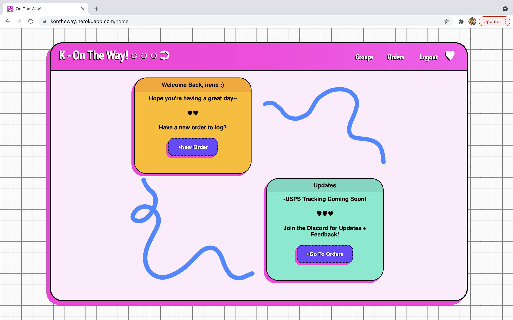
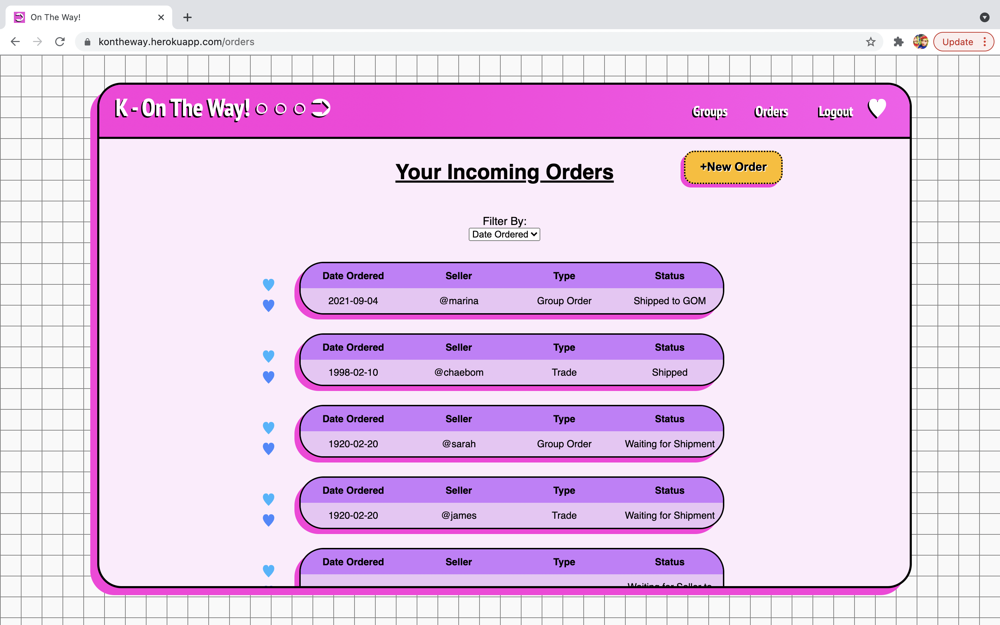
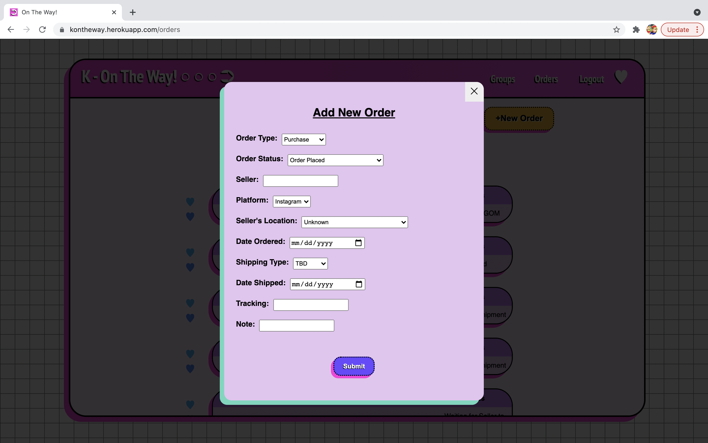
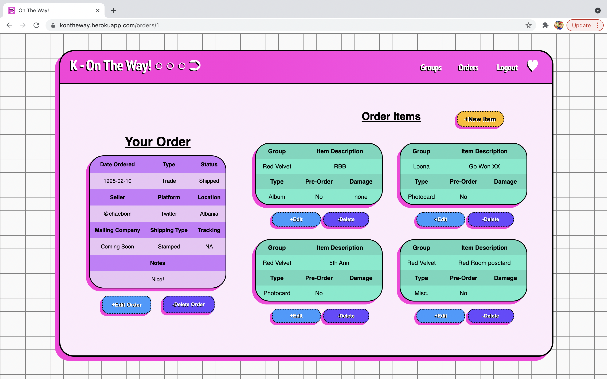
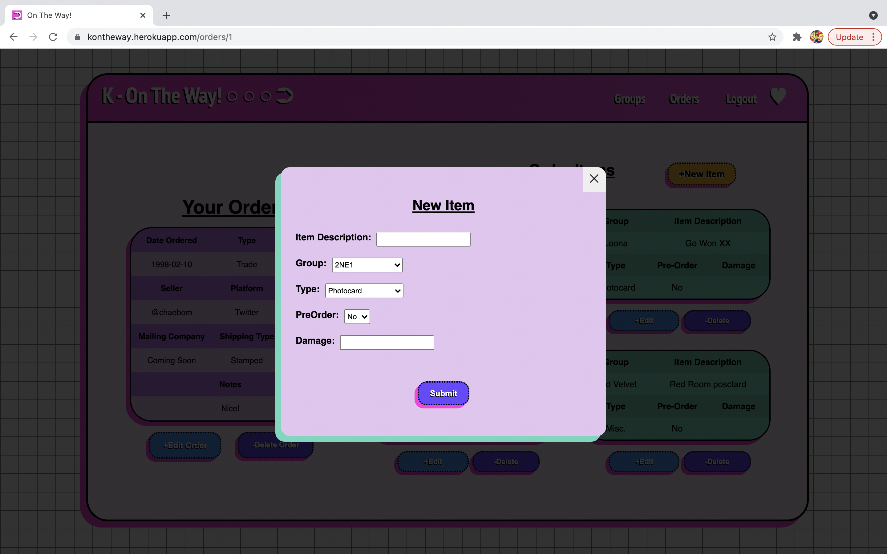
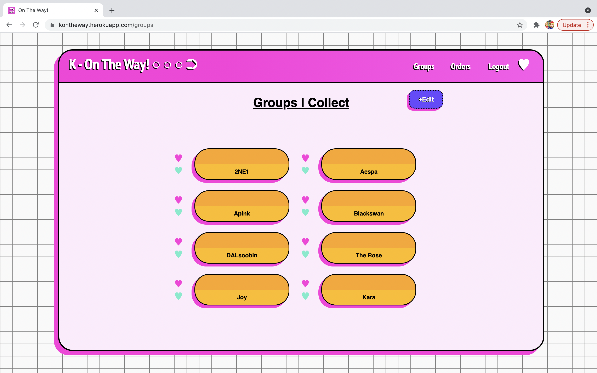
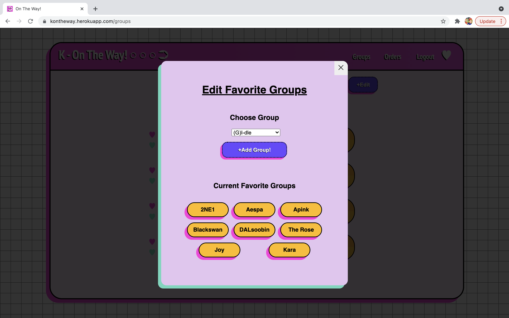

## K-On The Way!

K-On The Way! is website for ever forgetful Kpop collectors to keep track of their incoming purchases, trades, and group order slots. It includes OAuth for login and signup, React/Redux components for the front end, Express RESTful routes to the back end, PostgreSQL for the database, and Heroku for deployment.\
\
**Live**: <a href= "https://kontheway.herokuapp.com/"> https://kontheway.herokuapp.com/</a> \
\
**Discord**: Coming Soon! \
\
**Authors**: <a href= "https://www.linkedin.com/in/mafermafer/">María F. Hernández</a>

## To Start

Run npm install\
createdb otw\
Run npm run seed\
Run `npm start`

## Previews

**Home Page**

**All Orders**

**Add New Order**

**Single Order with Items**

**Add New Item To Order**

**Favorite Groups**

**Edit Favorite Groups**

  

## Technologies

<ul>
  <li>Javascript</li>
  <li>HTML</li>
  <li>CSS</li>
  <li>Node.js</li>
  <li>React / Redux </li>
  <li>Focus Trap React</li>
  <li>ClassNames</li>
  <li>Express</li>
  <li>Morgan</li>
  <li>Axios</li>
  <li>Sequelize</li>
  <li>PostgreSQL</li>
  <li>Bcrypt</li>
  <li>OAuth</li>
  <li>Webpack</li>
  <li>Heroku</li>
</ul>
